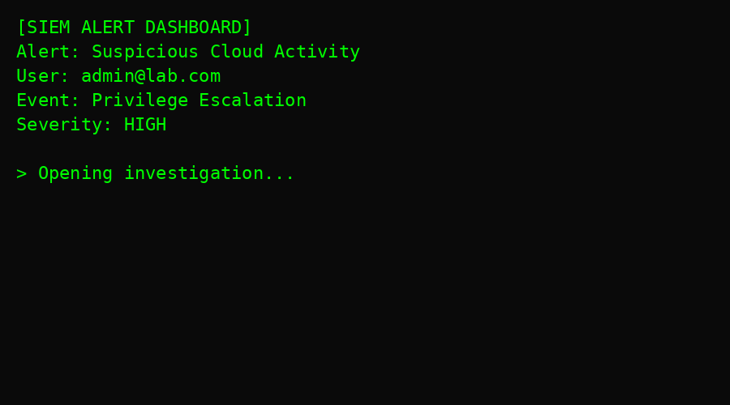
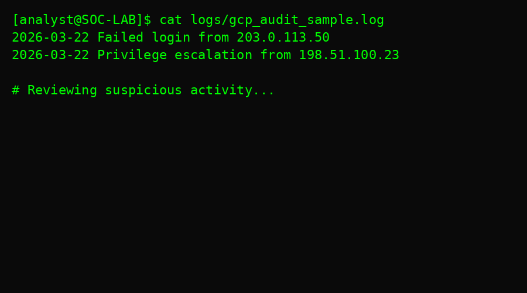

#  Cloud Security Detection Scenario

##  Overview

This project simulates a real-world cloud security incident involving **unauthorized access and privilege escalation**, demonstrating a full **SOC investigation workflow** from detection to response.

The objective is to showcase practical skills in:
- Cloud log analysis
- Threat detection and triage
- Incident response workflows
- Detection engineering (rules + scripts)

---

##  Full Incident Workflow Demo

---

##  SOC Terminal Investigation Demo

---

## Scenario Summary

A cloud environment generated suspicious audit logs indicating:

- Multiple failed login attempts from an external IP  
- A successful privilege escalation shortly after  
- Potential compromise of an administrative account  

The activity was analyzed, correlated, and escalated as a confirmed incident.

---

## Key Capabilities Demonstrated

- SIEM-style alert triage  
- Cloud audit log analysis  
- Threat hunting using command-line tools  
- Detection engineering (Python + Sigma)  
- IOC extraction and tracking  
- Incident response and containment planning  

---

##  Project Structure
cloud-security-detection/
├── README.md
├── assets/ # Demo GIFs
├── logs/ # Raw audit logs
├── analysis/ # Investigation + timeline
├── detection/ # Detection scripts + rules
├── iocs/ # Indicators of compromise
└── reports/ # Final incident report

---

##  Investigation Workflow

### 1. Alert Detection
- SIEM-style alert triggered on suspicious cloud activity  
- Privilege escalation flagged as high severity  

### 2. Log Analysis
- Reviewed audit logs for authentication anomalies  
- Identified suspicious IP addresses  

### 3. Threat Hunting
- Used command-line tools to correlate events  
- Confirmed pattern of login attempts → escalation  

### 4. Detection Execution
- Ran Python-based detection script  
- Identified and flagged malicious activity  

### 5. Incident Response
- Extracted IOCs  
- Defined containment actions  
- Documented findings in report  

---

## Detection Logic

### Python Detection Script
- Filters logs for:
  - Unauthorized login attempts  
  - Privilege escalation events  

### Sigma Rule
- Detects:
  - Suspicious cloud authentication activity  
  - Privilege abuse patterns  

---

## Indicators of Compromise (IOCs)

- Malicious IPs:
  - `203.0.113.50`
  - `198.51.100.23`

- Targeted Accounts:
  - `user@lab.com`
  - `admin@lab.com`

- Activity:
  - Unauthorized login attempts  
  - Privilege escalation  

---

##  Containment Actions

- Block malicious IP addresses  
- Disable compromised accounts  
- Enforce Multi-Factor Authentication (MFA)  
- Review IAM roles and permissions  
- Enhance logging and detection rules  

---

##  MITRE ATT&CK Mapping

- **T1078** – Valid Accounts  
- **T1078.004** – Cloud Accounts  
- **T1068** – Privilege Escalation  

---

## 📄 Final Report

📁 Located in:

/reports/final_cloud_security_report.pdf

Includes:
- Executive summary  
- Timeline of attack  
- Threat analysis  
- Detection logic  
- Response strategy  

---

##  Why This Repo Matters

This Repo demonstrates the **complete lifecycle of a cloud security incident**, similar to real-world workflows used by incident response teams at leading organizations like **Mandiant (Google Cloud)**.

It highlights the ability to:
- Detect threats in cloud environments  
- Investigate attacker behavior  
- Build detection mechanisms  
- Respond effectively to incidents  

---

## Author

**Cullen E. Mathews**  
Cybersecurity | SOC Analyst | Incident Response  

---

